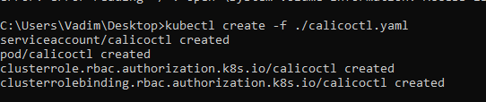

University: [ITMO](https://itmo.ru/ru/)  
Faculty: [FICT](https://fict.itmo.ru)  
Course: [Introduction to distributed technologies](https://github.com/itmo-ict-faculty/introduction-to-distributed-technologies)  
Year: 2024/2025  
Group: K4111c  
Author: [Russkin Vadim Denisovich](https://github.com/SolPot)  
Lab: [Laboratory Work №3 "Certificates and Secrets in Minikube, Secure Data Storage"](https://itmo-ict-faculty.github.io/introduction-to-distributed-technologies/education/labs2023_2024/lab3/lab3/)  
Date of create: 18.11.2024  
Date of finished: 19.11.2024  
### Ход работы  
1. Запуск `minikube` с `Calico` с двумя нодами:  
  
3.Проверка успешного запуска:  
  
4.Формирование [манифеста](ippool1.yaml) для `IPPool`:  
```yaml
apiVersion: apps/v1
kind: ReplicaSet
metadata:
  name: frontend-replicaset
  labels:
    app: front
spec:
  replicas: 2
  selector:
    matchLabels:
      app: front
  template:
    metadata:
      labels:
        app: front
    spec:
      containers:
      - name: frontend-container
        image: ifilyaninitmo/itdt-contained-frontend:master
        ports:
        - containerPort: 3000
        env:
        - name: REACT_APP_USERNAME
          valueFrom:
            configMapKeyRef:
              name: frontend-configmap
              key: react_app_user_name
        - name: REACT_APP_COMPANY_NAME
          valueFrom:
            configMapKeyRef:
              name: frontend-configmap
              key: react_app_company_name
```  
5.Назначение меток для нодов:  
  
6.Установка [манифеста](calicoctl.yaml):  
   
7.Просмотр пулов:  
  
8.Создание ресурсов на основе 'IPPool':  
  
9. Проверка создания ресурсов:    
  
10.Формирование [манифеста](deployment.yaml) для развертывания  
```yaml
apiVersion: apps/v1
kind: Deployment
metadata:
  name: front-deplt
  labels:
    app: fronted
spec:
  replicas: 2
  selector:
    matchLabels:
      app: fronted
  template:
    metadata:
      labels:
        app: fronted
    spec:
      containers:
      - name: frontned-container
        image: ifilyaninitmo/itdt-contained-frontend:master
        resources: 
          limits:
            memory: "512M"
            cpu: ".5"
        ports:
        - containerPort: 3000
        env:
        - name: REACT_APP_USERNAME
          value: Russkin_Vadim
        - name: REACT_APP_COMPANY_NAME
          value: ITMO
```  
11.Формирование [манифеста](service.yaml) для развертывания сервисов:  
```yaml
apiVersion: v1
kind: Service
metadata:
  name: service
spec:
  selector:
    app: fronted
  ports:
    - port: 3000
      targetPort: 3000
  type: LoadBalancer
``` 
12. Проверка сервисов:  
```yaml
apiVersion: networking.k8s.io/v1
kind: Ingress
metadata:
  name: frontend-ingress
spec:
  tls:
  - hosts:
      - fronted.edu
    secretName: fronted-tls
  rules:
  - host: fronted.edu
    http:
      paths:
      - path: /
        pathType: Prefix
        backend:
          service:
            name: frontend-service
            port:
              number: 3000
```   
12. Проброс порта
    
14. Проверка доступности контейнера    
  
Схема организация контейнеров и сервисов  
  
