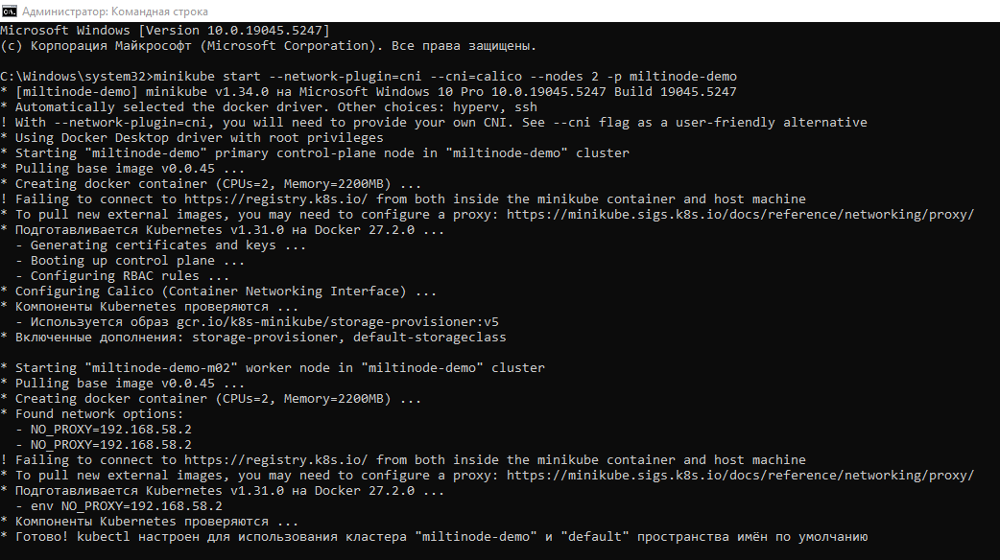
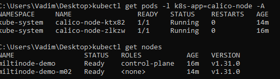
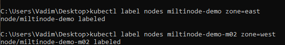
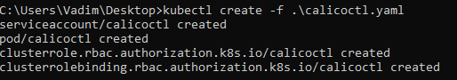
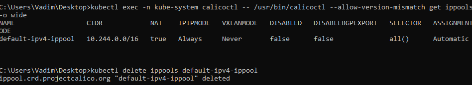
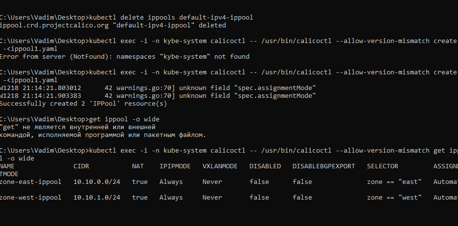
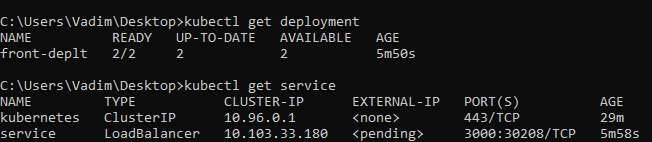
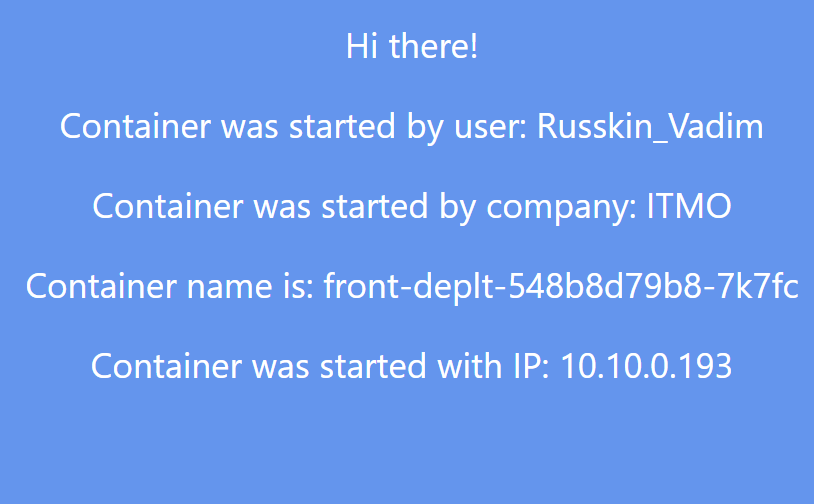
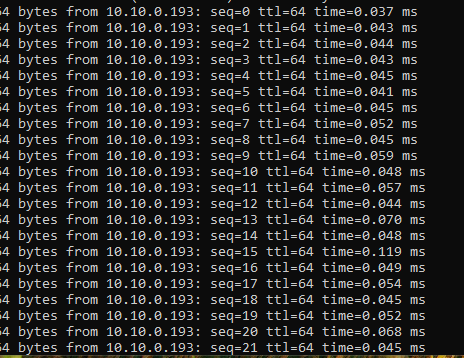
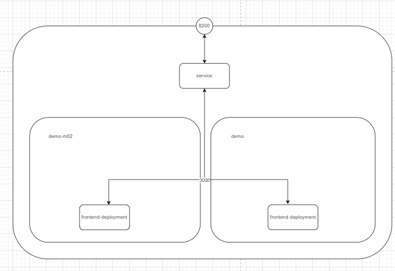

University: [ITMO](https://itmo.ru/ru/)  
Faculty: [FICT](https://fict.itmo.ru)  
Course: [Introduction to distributed technologies](https://github.com/itmo-ict-faculty/introduction-to-distributed-technologies)  
Year: 2024/2025  
Group: K4111c  
Author: [Russkin Vadim Denisovich](https://github.com/SolPot)  
Lab: [Laboratory Work №4 "Communication Networks in Minikube, CNI, and CoreDNS"](https://itmo-ict-faculty.github.io/introduction-to-distributed-technologies/education/labs2023_2024/lab4/lab4/)  
Date of create: 19.11.2024  
Date of finished: 19.11.2024  
### Ход работы  
1. Запуск `minikube` с `Calico` с двумя нодами:  
  
2.Проверка успешного запуска:  
  
3.Формирование [манифеста](ippool1.yaml) для `IPPool`:  
```yaml
apiVersion: apps/v1
kind: ReplicaSet
metadata:
  name: frontend-replicaset
  labels:
    app: front
spec:
  replicas: 2
  selector:
    matchLabels:
      app: front
  template:
    metadata:
      labels:
        app: front
    spec:
      containers:
      - name: frontend-container
        image: ifilyaninitmo/itdt-contained-frontend:master
        ports:
        - containerPort: 3000
        env:
        - name: REACT_APP_USERNAME
          valueFrom:
            configMapKeyRef:
              name: frontend-configmap
              key: react_app_user_name
        - name: REACT_APP_COMPANY_NAME
          valueFrom:
            configMapKeyRef:
              name: frontend-configmap
              key: react_app_company_name
```  
4.Назначение меток для нодов:  
  
5.Установка [манифеста](calicoctl.yaml):  
   
6.Просмотр пулов:  
  
7.Удаление дефолтных ip, создание ресурсов на основе 'IPPool'и его проверка:  
  
8.Формирование [манифеста](deployment.yaml) для развертывания:  
```yaml
apiVersion: apps/v1
kind: Deployment
metadata:
  name: front-deplt
  labels:
    app: fronted
spec:
  replicas: 2
  selector:
    matchLabels:
      app: fronted
  template:
    metadata:
      labels:
        app: fronted
    spec:
      containers:
      - name: frontned-container
        image: ifilyaninitmo/itdt-contained-frontend:master
        resources: 
          limits:
            memory: "512M"
            cpu: ".5"
        ports:
        - containerPort: 3000
        env:
        - name: REACT_APP_USERNAME
          value: Russkin_Vadim
        - name: REACT_APP_COMPANY_NAME
          value: ITMO
```  
9.Формирование [манифеста](service.yaml) для развертывания сервисов:  
```yaml
apiVersion: v1
kind: Service
metadata:
  name: service
spec:
  selector:
    app: fronted
  ports:
    - port: 3000
      targetPort: 3000
  type: LoadBalancer
``` 
10. Проверка сервисов:  
  
11.Проброс порта командой:  
  
12. Проверка доступности контейнера:  
  
Схема организация контейнеров и сервисов  
  
P.S. Были ошибки связанные с дублированием "\" (windows), а также ошибки по невнимательности (не увидил, что у нода идёт иницилизация или то что не готовы поды), в следствии чего, на проверке сервисов => сервисы не были запущены.
